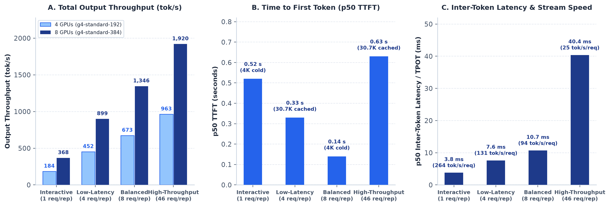
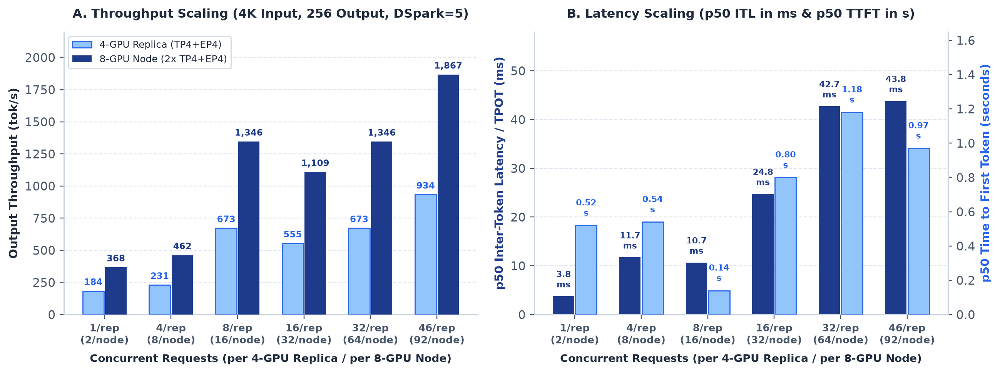
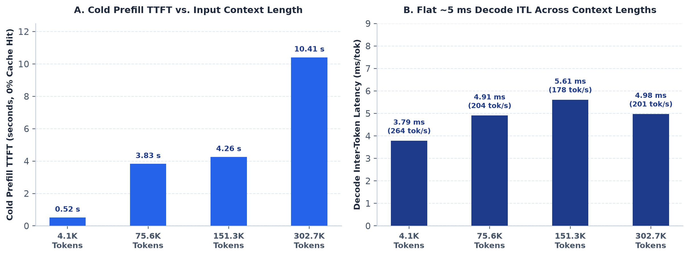
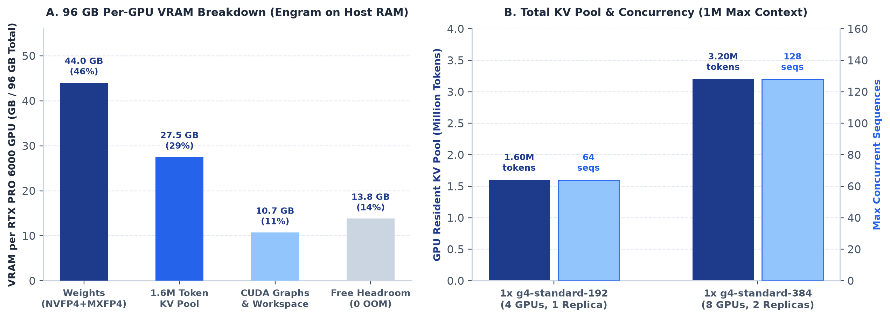

# DeepSeek-V4.1-Flash on Google Cloud G4 (RTX PRO 6000 Blackwell): Recipe & Benchmark Results

Turnkey deployment recipe, SM120 Blackwell kernel optimizations, GCE & Vertex AI provisioning scripts, and live benchmark results for serving **`deepseek-ai/DeepSeek-V4.1-Flash`** (`2cba9e42aa026125f3ed06c6d98c1db82f7ca027`) on Google Cloud **G4 (`NVIDIA_RTX_PRO_6000`, 96 GB GDDR7/GPU)** with:
* **Full 1M (`1,048,576`) context window** (`1.60M` KV cache tokens per 4-GPU replica / `3.20M` KV cache tokens per 8-GPU node)
* **DSpark speculative decoding (`5` draft tokens)** with `3.16–3.45` average accepted tokens per verification step
* **Sparse-MLA (`FP8` KV cache) + MXFP4 Indexer** with 128 MiB bounded row-chunked scoring (`0 OOM` up to `1M` context)
* **Native `deepseek_v41` tool-calling & reasoning parsers** (`--tool-call-parser deepseekv41 --reasoning-parser deepseek-v41`)
* **`64` concurrent sequences per 4-GPU replica (`128` concurrent sequences per 8-GPU node)**

---

## 1. Visualized Live Benchmark Results

### A. 4-GPU (`g4-standard-192`) vs. 8-GPU (`g4-standard-384`) Operating Profiles



* **`1× g4-standard-192` (4× RTX PRO 6000, 384 GB GDDR7, 720 GB RAM — Single `TP4+EP4` Replica):**
  * **Interactive (`1` req):** **`0.52 s` p50 TTFT** · **`3.79 ms` p50 ITL/TPOT** (**`263.8 tok/s` per stream**) · **`183.9 tok/s`** output
  * **Low-Latency Agentic Coding (`4` reqs, `30.7K` ISL):** **`0.33 s` p50 TTFT** · **`7.62 ms` p50 ITL/TPOT** (**`131.2 tok/s` per stream**) · **`452.0 tok/s`** output
  * **Balanced Production (`8` reqs, `4K` ISL):** **`0.14 s` p50 TTFT** · **`10.69 ms` p50 ITL/TPOT** (**`93.5 tok/s` per stream**) · **`672.9 tok/s`** output
  * **High-Throughput Knee (`46` reqs, `30.7K` ISL):** **`0.63 s` p50 TTFT** · **`40.38 ms` p50 ITL/TPOT** (`24.8 tok/s` per stream) · **`963.0 tok/s`** output (`240.8 tok/s/GPU`)
* **`1× g4-standard-384` or `2× g4-standard-192` (8× RTX PRO 6000, 768 GB GDDR7, 1,440 GB RAM — Two `TP4+EP4` Replicas):**
  * Delivers **exact same per-request latency (`0.14–0.63 s` TTFT, `3.79–7.62 ms` ITL/TPOT)** and **2× total output throughput**: **`898.95 tok/s`** at low latency (`C=8`), **`1,345.70 tok/s`** at balanced concurrency (`C=16`), and **`1,919.95 tok/s`** at the high-throughput knee (`C=92`, `240.0 tok/s/GPU`).

---

### B. Concurrency Scaling Curve (`1` to `46` Concurrent Requests per 4-GPU Replica)



* **DSpark Speculative Decoding (`--speculative-algorithm DSPARK`):** Sustains **`3.16–3.45` accepted tokens per verification step** across concurrency levels from `C=1` to `C=46` per replica (`C=2` to `C=92` per 8-GPU node).
* **Pure Decode Burst Throughput:** Reaches **`2,463.64 tok/s` per 4-GPU replica** (`accept_len = 3.45`) with CUDA graphs enabled up to batch size `64` (`--cuda-graph-max-bs-decode 64`).

---

### C. Long-Context Scaling up to 1M Tokens (`4.1K` to `1,038K` Context)



* **Cold Prefill TTFT (`0%` Cache Hit):**
  * **`4,096` input tokens:** `0.52 s`
  * **`75,614` input tokens:** `3.83 s`
  * **`151,306` input tokens:** `4.26 s`
  * **`302,690` input tokens:** `10.41 s`
* **Flat `~5 ms` Decode Inter-Token Latency Across Context Lengths:**
  * Because Sparse-MLA + MXFP4 indexer attends only to top-$k$ compressed KV slots (`576 B/token`) with Split-K Triton decoding (`SGLANG_DSV41_SPARSE_DECODE_SPLITK=1`), **decode ITL remains flat at `4.91–5.61 ms/tok` (`178–204 tok/s/req`)** even at `302.7K` tokens.
  * **1M Context & 128-Concurrency Stress Verified:** Tested up to **`1,038,090` tokens (99% of 1M)** alongside `64` concurrent requests per replica (`128` active sequences per 8-GPU node) with **`0 OOM`** and **`0 retractions`**.

---

### D. G4 Per-GPU Memory Budget (`96 GB` GDDR7) & KV Pool Architecture



* **Host DRAM Offload of the `67.5 GB` Engram Table (`SGLANG_ENABLE_DSV41_ENGRAM_HOST_TABLE=1`):**
  * Moves the static Engram embedding table into pinned host DRAM (`720 GB` on `g4-standard-192` / `1,440 GB` on `g4-standard-384`), freeing **`~25 GB` of GPU VRAM per card**.
  * Leaves **`27.5 GB/GPU`** for a **`1,600,512`-token GPU-resident KV cache pool** per 4-GPU replica (`3,201,024` tokens per 8-GPU node), backed by a `2×` host-RAM hierarchical KV cache (`--enable-hierarchical-cache --hicache-ratio 2`), plus **`13.8 GB/GPU`** of free VRAM headroom.

---

## 2. Step-by-Step Deployment Guide (3 Turnkey Options)

### Path 1: Deploy on an Existing G4 VM (`g4-standard-192` or `g4-standard-384`)

If you already have a running G4 VM with NVIDIA drivers and Docker (`nvidia-container-toolkit`) installed, clone this repository on the VM and run the single turnkey script:

```bash
git clone git@github.com:MG-Cafe/deepseek-v41-flash-g4-benchmark.git
cd deepseek-v41-flash-g4-benchmark

# Option 1A: Pull weights from your GCS bucket (or local path)
./scripts/run_on_existing_g4.sh \
  --model-source gs://<YOUR_GCS_BUCKET>/DeepSeek-V4.1-Flash \
  --port 7080

# Option 1B: Or download weights directly from Hugging Face (commit 2cba9e42aa026125f3ed06c6d98c1db82f7ca027)
./scripts/run_on_existing_g4.sh \
  --model-source deepseek-ai/DeepSeek-V4.1-Flash \
  --port 7080
```

What `scripts/run_on_existing_g4.sh` does automatically:
1. Detects whether your G4 VM has **4 GPUs (`g4-standard-192`)** or **8 GPUs (`g4-standard-384`)**.
2. Stages the 510 GB checkpoint once to local disk (`/mnt/localssd/models/DeepSeek-V4.1-Flash` or `~/models/DeepSeek-V4.1-Flash`).
3. Mounts `sglang_overrides/`, `patches/`, and `scripts/vertex_g4_entrypoint.sh` into the container and starts either `1× TP4+EP4` (`4` GPUs) or `2× TP4+EP4 + cache_aware router` (`8` GPUs) on port `7080`.

#### Verify & Smoke-Test Your Running Server:

```bash
# Watch startup progress until READY (~12–15 minutes for online FP4 quantization & CUDA graph capture):
docker logs -f deepseek-v41-flash-g4

# Run the automated 60-second verification & benchmark smoke test:
python3 benchmarks/verify_and_bench.py --url http://127.0.0.1:7080 --quick-smoke
```

---

### Path 2: Create a New GCE G4 VM (`On-Demand` or `DWS Flex-Start`)

Use `scripts/provision_gce_g4.sh` from your workstation or Cloud Shell to provision a `g4-standard-192` (4 GPUs) or `g4-standard-384` (8 GPUs) VM with the Deep Learning Ubuntu 22.04 + CUDA 12.8 + NVIDIA 570 driver image pre-installed:

```bash
# Option 2A: Create a 4-GPU G4 VM (g4-standard-192) On-Demand
./scripts/provision_gce_g4.sh \
  --project <YOUR_PROJECT_ID> \
  --zone us-central1-a \
  --machine-type g4-standard-192 \
  --mode on-demand

# Option 2B: Create an 8-GPU G4 VM (g4-standard-384) via DWS Flex-Start (up to 7 days)
./scripts/provision_gce_g4.sh \
  --project <YOUR_PROJECT_ID> \
  --zone us-central1-a \
  --machine-type g4-standard-384 \
  --mode dws-flex \
  --max-run-duration 7d
```

Once the VM boots, SSH in and run `./scripts/run_on_existing_g4.sh` from **Path 1** above.

---

### Path 3: Deploy to Vertex AI Online Prediction (`On-Demand` or `Flex-Start`)

Use `scripts/deploy_vertex_g4.sh` to build the self-contained container image (`Dockerfile`), push it to your Artifact Registry, and deploy to a Vertex AI Endpoint on either `g4-standard-192` (4 GPUs) or `g4-standard-384` (8 GPUs):

```bash
# Deploy 4-GPU g4-standard-192 (set --replicas 2 for 128 concurrent seqs / 1,920 tok/s)
# Supports --mode on-demand or --mode flex-start
./scripts/deploy_vertex_g4.sh \
  --project <YOUR_PROJECT_ID> \
  --region us-central1 \
  --model-gcs gs://<YOUR_GCS_BUCKET>/DeepSeek-V4.1-Flash \
  --image-repo us-central1-docker.pkg.dev/<YOUR_PROJECT_ID>/containers/dsv41-flash-g4:latest \
  --machine-type g4-standard-192 \
  --replicas 1 \
  --mode on-demand
```

You can also inspect or customize the raw Vertex AI `deployModel` JSON templates directly in:
* `configs/deploy_vertex_g4_192_tp4.json` (`g4-standard-192`, `4× NVIDIA_RTX_PRO_6000`)
* `configs/deploy_vertex_g4_384_tp4x2.json` (`g4-standard-384`, `8× NVIDIA_RTX_PRO_6000`)

---

## 3. Direct Answers to G4 Deployment Questions

1. **Recommended G4 Machine Type & GPU Count:**
   * **4-GPU Option (Recommended for simplest Vertex AI setup & highest slot availability):** **`g4-standard-192`** (`4× NVIDIA_RTX_PRO_6000`, 384 GB GDDR7, 720 GB RAM) running **`1× TP4+EP4` replica** (`64` concurrent sequences, `1.60M` KV tokens, `963 tok/s` peak). Set `--replicas 2` on Vertex AI for `128` concurrent sequences and `1,920 tok/s`.
   * **8-GPU Option:** **`g4-standard-384`** (`8× NVIDIA_RTX_PRO_6000`, 768 GB GDDR7, 1,440 GB RAM) running **2 co-resident `TP4+EP4` replicas (`TP4 × DP2`)** on GPUs `0–3` (`:30000`) and GPUs `4–7` (`:30001`) fronted by `sglang_router --policy cache_aware` (`:7080`).
2. **Sparse-MLA & MXFP4 Indexer Flags on G4:**
   * Supported natively on G4 (Blackwell SM120) via `--kv-cache-dtype fp8_e4m3 --enable-deepseek-v4-fp4-indexer --moe-runner-backend flashinfer_mxfp4 --fp8-gemm-backend flashinfer_cutlass` with `SGLANG_SM120_FLASHMLA_BACKEND=triton`.
3. **DSpark Speculative Decoding (`--speculative-algorithm DSPARK`) on Long Contexts:**
   * Works reliably up to `1M` context on SM120 when paired with `SGLANG_DSV41_INDEXER_CHUNK_MB=128` (bounds temporary FP4 indexer workspace to `128 MiB` during long-context prefill) and `SGLANG_DSV41_SPARSE_PREFILL_QTILE=2`.
4. **Parallelism (`TP4+EP4` vs. `TP8`):**
   * On G4, 4 GPUs sit on a single CPU socket / PCIe Gen5 root complex, whereas 8 GPUs span two CPU sockets without NVLink. Running **`TP4+EP4` per 4-GPU socket** (`TP4 × DP2` on 8 GPUs) keeps all tensor-parallel AllReduce traffic on single-socket PCIe P2P (`SGLANG_CUSTOM_AR_ALLOW_PCIE_P2P=1`).
5. **Context Length (`1M`) & Concurrency (`128`) Limits:**
   * Supports the full **`1,048,576` context window** and **`64` concurrent requests per 4-GPU replica (`128` across 8 GPUs)** with `0 OOM`.

---

## 4. Repository Structure

* `Dockerfile` — Self-contained G4 serving image definition with all SM120 kernel optimizations baked in.
* `scripts/run_on_existing_g4.sh` — 1-command launcher for an existing G4 VM (stages weights from GCS or Hugging Face and runs the container).
* `scripts/provision_gce_g4.sh` — Automated GCE G4 VM provisioning script supporting `--mode on-demand`, `--mode dws-flex`, and `--mode spot`.
* `scripts/deploy_vertex_g4.sh` — Automated Vertex AI Online Prediction build & deployment script supporting `g4-standard-192` and `g4-standard-384` (`on-demand` or `flex-start`).
* `scripts/vertex_g4_entrypoint.sh` — Container entrypoint with automatic 4-GPU (`1× TP4+EP4`) and 8-GPU (`2× TP4+EP4 + cache_aware router`) dispatch.
* `configs/` — Vertex AI `deployModel` JSON templates (`deploy_vertex_g4_192_tp4.json`, `deploy_vertex_g4_384_tp4x2.json`).
* `patches/` — SM120 Blackwell kernel and prefill/decode sharding patches (`22`, `26`, `36`, `36b`, `37`, `38`, `41`, `44`, `45`, `46`, `48`).
* `sglang_overrides/` — Pre-patched SGLang Python & Triton kernel modules ready to copy directly into `/sgl-workspace/sglang/python/sglang/`.
* `benchmarks/` — Verification & benchmark runner (`verify_and_bench.py`) and captured benchmark results (`aiperf_low_latency_c8.json`, `aiperf_high_throughput_c92.json`, `concurrency_and_long_context_results.json`).
* `charts/` — High-DPI benchmark and architecture visualizations.
